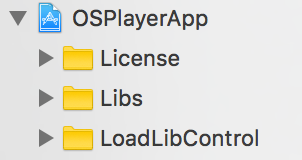
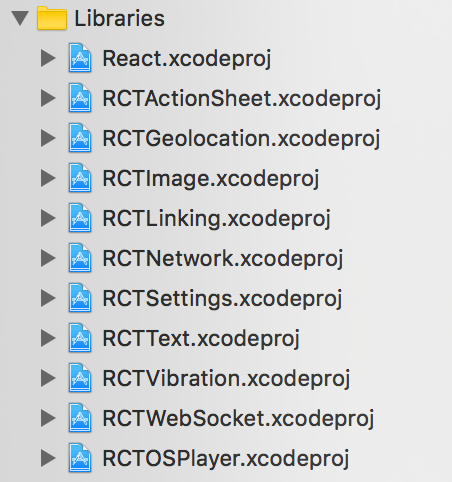
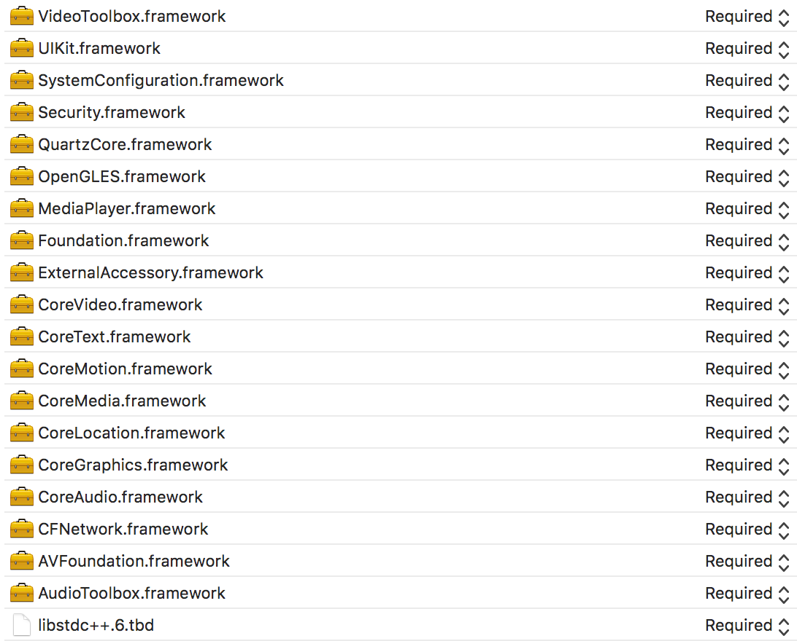

# react-native-osplayer

## Installation

Several options exist for including the module in your project:
- add the git repo to package.json as a dependency (`react-native-osplayer: "decosoftware/react-native-osplayer"`)
- publish a private npm package, adding it as a dependency
- copy and paste the code directly into the app
- git subtree

The easiest way to install a native module, while still being able to develop the module as a standalone library, is with `git subtree`.

We're going to add a `git subtree` to the root of your React Native app. This will let us `import OSPlayer from 'react-native-osplayer'` just as if we had installed the library in `node_modules`.

Run the following commands from the root directory of your React Native app.

#### Adding a subtree

To do this, first set up the repo as a remote (let's call the remote `rnos`):

```
git remote add rnos https://github.com/decosoftware/react-native-osplayer.git
```

Next, add the repo as a subtree:

```
git subtree add --prefix react-native-osplayer rnos master --squash
```

That's it! If you don't need to sync with upstream, you don't need to do anything else.

#### Syncing with upstream

To pull in new changes from upstream, run:

```
git subtree pull --prefix=react-native-osplayer rnos master --squash
```

To push new changes upstream, run:

```
git subtree push --prefix=react-native-osplayer rnos master
```

## Linking

#### iOS

1: Copy the `License`, `Libs` and `LoadLibControl` from `react-native-osplayer/ios` into your Xcode project by dragging them into the file list. Allow Xcode to copy the files if needed.



2: Drag the `RCTOSPlayer.xcodeproj` into the Libraries folder in your project.



3: In your Build Phases > Link Binary with Libraries for your project, drag in `libRCTOSPlayer.a` from the Products folder within `RCTOSPlayer.xcodeproj` (expanded in the file list). And then add the following frameworks and libraries:



#### Android

1: Include the module in gradle settings, pointing to its directory.

**`android/settings.gradle`**

```
include ':player'
project(':player').projectDir = new File(rootProject.projectDir, '../react-native-osplayer/android')
```

2: Add the project to the list of build dependencies.

**`android/app/build.gradle`**

```
...
dependencies {
  ...
  compile project(':player')
}
```

3: Instantiate the package with `new OSPlayerPackage()` and return it in the list of native packages.

**`MainApplication.java`**
```
@Override
protected List<ReactPackage> getPackages() {
  return Arrays.<ReactPackage>asList(
      new MainReactPackage(),
      new OSPlayerPackage()
  );
}
```

## Usage

```js
import OSPlayer from 'react-native-osplayer'

<OSPlayer
  ref={(ref) => {
    this.player = ref
  }}                                           // Store the reference
  src={{
    uri: 'http://devimages.apple.com/iphone/samples/bipbop/bipbopall.m3u8',
    // drm: 'http://key.luve.tv/',
  }}                                           // Video
  style={{
    width: 200,
    height: 200,
  }}                                           // Element sytle
  fullscreen={false}                           // Fullscreen
  paused={false}                               // Pause the video
  volume={1}                                   // Set volume level (0 to 1)
  muted={false}                                // Mute the audio
  renderControls={this.renderControls}         // Render video player UI
/>
```

We've also provided a wrapper component that includes UI for play/pause and going fullscreen. If you want to use this component to get up and running immediately:

```js
import { OSPlayerWithControls } from 'react-native-osplayer'

<OSPlayerWithControls
  src={{
    uri: 'http://devimages.apple.com/iphone/samples/bipbop/bipbopall.m3u8',
    // drm: 'http://key.luve.tv/',
  }}
  style={{
    width: 200,
    height: 200,
  }}
/>
```
